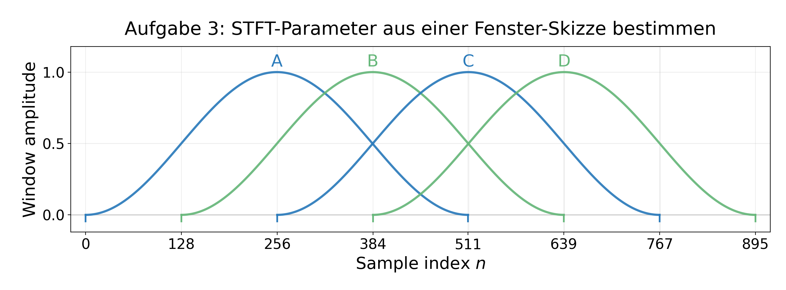
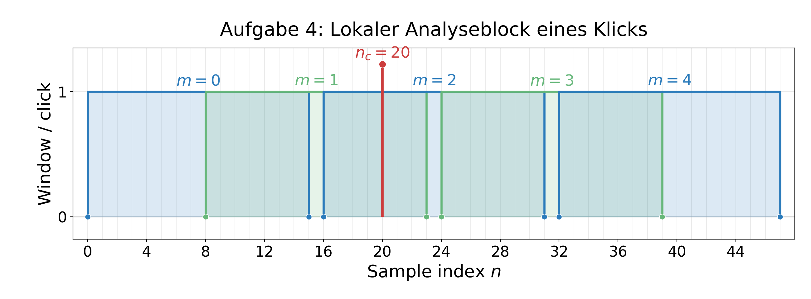
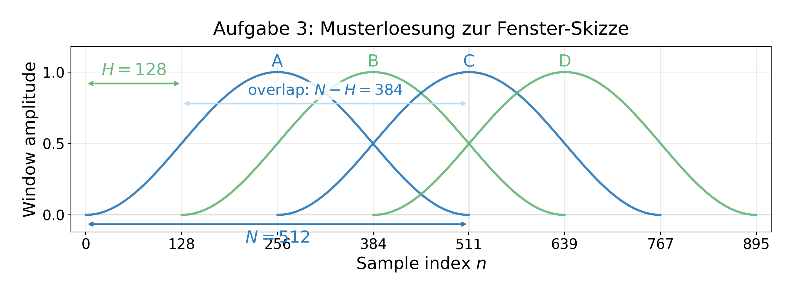
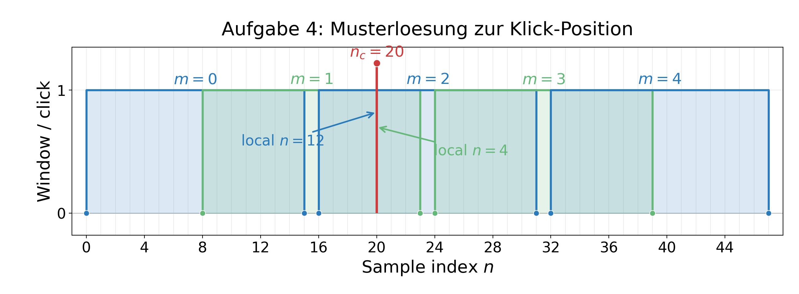

# Block 4: Hausaufgaben

Grundlage sind die STFT-Folien mit der Notation \(X[m,k]\), \(\Omega_k = 2\pi k/N\), \(n_m=mH\) und \(t_m=n_m/f_s\) sowie die Aufgabenstruktur der Grundlagen-Aufgabensammlung.

# Teil A: Aufgabenblatt fuer Studierende

## Selbstlernphase: Kurzzeit-Fourier-Transformation, Fensterpositionen und Spektrogramme

Nach der Bearbeitung dieser Aufgaben sollen Sie STFT-Parameter ausrechnen, Fensterpositionen im Abtastindex \(n\) einzeichnen, aus einer Fensterdarstellung die zugehoerigen Parameter bestimmen und fuer typische Audio-Engineering-Anwendungen geeignete Analyseparameter begruendet auswaehlen koennen.

---

## Aufgabe 1: Frequenzraster eines Audio-Analyzers

Sie verwenden in einer DAW einen Spektrumanalysator, um einen Gitarrenton und einen 1-kHz-Testton zu kontrollieren. Das Audiosignal wird mit

$$
f_s = 48\,\text{kHz}
$$

abgetastet. Fuer die DFT eines Analyseblocks wird zunaechst eine Blocklaenge von

$$
N = 4800
$$

Samples verwendet.

(a) Bestimmen Sie die Beobachtungsdauer \(T_\text{obs}\) des Analyseblocks und den Frequenz-Binabstand \(\Delta f\).

(b) Bestimmen Sie den Binabstand der diskreten Kreisfrequenz \(\Delta \Omega\). Berechnen Sie anschliessend fuer \(k=44\) und \(k=100\) jeweils die diskrete Kreisfrequenz \(\Omega_k\) und die zugehoerige Frequenz \(f_k\) in Hz.

(c) Ordnen Sie die beiden Bins aus Teilaufgabe (b) sinnvollen Audiofrequenzen zu. Welche der beiden Frequenzen koennte zu einem Kammerton A bzw. zu einem 1-kHz-Testton passen?

(d) Geben Sie fuer ein reelles Audiosignal den sinnvoll interpretierbaren einseitigen Frequenzbereich der DFT an. Welche Bin-Indizes gehoeren zu diesem Bereich?

(e) Der Analyzer wird auf \(N=2400\) Samples umgestellt. Diskutieren Sie, was sich dadurch an Beobachtungsdauer, Frequenzaufloesung und praktischer Nutzbarkeit fuer die Tonhoehenanalyse aendert.

---

## Aufgabe 2: STFT-Fenster auf der \(n\)-Achse einzeichnen

Fuer die Spektrogramm-Analyse einer perkussiven Aufnahme wird eine STFT mit Rechteckfenster verwendet. Das Fenster sei gegeben durch

$$
w[n] =
\begin{cases}
1, & 0 \leq n \leq N-1 \\
0, & \text{sonst}
\end{cases}
$$

Die Parameter lauten:

$$
f_s = 48\,\text{kHz}, \qquad N = 960, \qquad H = 240
$$

Dabei ist \(H\) die Hop Size, also die Schrittweite zwischen zwei benachbarten STFT-Frames.

(a) Zeichnen Sie auf einer \(n\)-Achse von \(n=0\) bis \(n=2000\) die Fensterpositionen fuer die Frames

$$
m = 0,1,2,3,4
$$

ein. Markieren Sie jeweils den Startindex \(n_m\) und den Endindex des Fensters.

(b) Berechnen Sie fuer die benachbarten Fenster die Ueberlappung in Samples und in Prozent der Fensterlaenge.

(c) Berechnen Sie fuer alle fuenf Frames die Startzeit

$$
t_m = \frac{n_m}{f_s}
$$

in Millisekunden.

(d) Bestimmen Sie, wie viele Spektrogramm-Spalten pro Sekunde entstehen. Erlaeutern Sie kurz, was diese Spaltendichte fuer die zeitliche Darstellung von Transienten bedeutet.

---

## Aufgabe 3: STFT-Parameter aus einer Fenster-Skizze bestimmen

Bei der Analyse eines Sprachsignals wird Ihnen folgende vereinfachte Skizze mehrerer ueberlappender Hann-Fenster auf der \(n\)-Achse gegeben. Fuer die Auswertung ist nur relevant, ueber welchem Samplebereich das jeweilige Fenster liegt.

$$
f_s = 48\,\text{kHz}
$$

Skizzierte Fensterbereiche:

$$
\begin{array}{c|c}
\text{Fenster} & \text{sichtbarer Bereich auf der } n\text{-Achse} \\
\hline
A & n = 0 \ldots 511 \\
B & n = 128 \ldots 639 \\
C & n = 256 \ldots 767 \\
D & n = 384 \ldots 895
\end{array}
$$

(a) Bestimmen Sie aus der Skizze die Fensterlaenge \(N\), die Hop Size \(H\), die Ueberlappung in Samples und die Ueberlappung in Prozent.

(b) Ordnen Sie den Fenstern A bis D die Frame-Indizes \(m\) zu und geben Sie fuer jedes Fenster den Startindex \(n_m\) an.

(c) Berechnen Sie die Startzeiten \(t_m\) der dargestellten Frames in Millisekunden. Wie gross ist der zeitliche Abstand zweier benachbarter Spektrogramm-Spalten?

(d) Ein kurzer Klick tritt bei \(n=600\) auf. Bestimmen Sie, in welchen der dargestellten Fensterbereiche dieser Klick enthalten ist. Beschreiben Sie, wie sich dies im Spektrogramm qualitativ auswirken kann.

(e) Entscheiden Sie, welche der folgenden Parameterkombinationen zur gegebenen Skizze passt. Begruenden Sie Ihre Entscheidung.

$$
\begin{array}{c|c|c}
\text{Variante} & N & H \\
\hline
1 & 512 & 128 \\
2 & 512 & 256 \\
3 & 1024 & 128
\end{array}
$$

---

## Aufgabe 4: Lokaler Analyseblock und STFT eines Klicks

Sie analysieren ein sehr kurzes digitales Testsignal, das einen einzelnen Klick enthaelt. Das Signal ist ueberall null, ausser bei

$$
n_c = 20
$$

Dort gilt:

$$
x[20] = 1
$$

Die STFT wird mit folgenden Parametern durchgefuehrt:

$$
f_s = 8\,\text{kHz}, \qquad N = 16, \qquad H = 8
$$

Als Fenster wird ein Rechteckfenster verwendet. Die STFT sei gegeben durch

$$
X[m,k] =
\sum_{n=0}^{N-1}
x[n+mH]\,w[n]\,e^{-j\Omega_k n}
$$

mit

$$
\Omega_k = \frac{2\pi k}{N}
$$

(a) Bestimmen Sie fuer die Frames \(m=0,1,2,3,4\) jeweils den Startindex, den Endindex und die Startzeit.

(b) Bestimmen Sie, in welchen Frames der Klick bei \(n_c=20\) enthalten ist. Geben Sie fuer diese Frames jeweils den lokalen Index innerhalb des Analyseblocks an.

(c) Setzen Sie fuer einen Frame, der den Klick enthaelt, den lokalen Analyseblock in die STFT-Gleichung ein. Beschreiben Sie, wie der Betrag \(|X[m,k]|\) ueber die Frequenz-Bins \(k=0,\ldots,15\) aussieht.

(d) Erklaeren Sie qualitativ, wie ein einzelner Klick im Spektrogramm erscheint. Vergleichen Sie dies mit einem idealen, ueber viele Frames andauernden 1-kHz-Sinuston bei denselben STFT-Parametern.

---

## Aufgabe 5: STFT-Parameter fuer Audioanwendungen auswaehlen

Sie sollen fuer unterschiedliche Analyseaufgaben in einer DAW geeignete STFT-Parameter auswaehlen. Die Abtastfrequenz betraegt

$$
f_s = 48\,\text{kHz}
$$

Zur Auswahl stehen drei Einstellungen:

$$
\begin{array}{c|c|c}
\text{Einstellung} & N & H \\
\hline
A & 256 & 64 \\
B & 1024 & 256 \\
C & 4096 & 1024
\end{array}
$$

(a) Berechnen Sie fuer jede Einstellung die Fensterdauer in Millisekunden, die Hop-Dauer in Millisekunden, den Frequenz-Binabstand \(\Delta f\), die Ueberlappung in Prozent und die Anzahl der Spektrogramm-Spalten pro Sekunde.

(b) Waehlen Sie eine geeignete Einstellung fuer die Transientenanalyse einer Snare-Drum-Aufnahme. Begruenden Sie Ihre Wahl.

(c) Waehlen Sie eine geeignete Einstellung fuer die Analyse von Tonhoehe und Harmonischen einer Stimme oder Gitarre. Begruenden Sie Ihre Wahl.

(d) Waehlen Sie eine geeignete Einstellung, um ein stationaeres Netzbrummen im Bereich von 50 Hz bzw. 60 Hz zu erkennen. Begruenden Sie Ihre Wahl.

(e) Diskutieren Sie, warum fuer eine spaetere iSTFT bzw. fuer Time-Stretching-Anwendungen eine sinnvolle Ueberlappung und ein geeignetes Fenster wichtig sind. Beschreiben Sie kurz, was bei zu grosser Hop Size hoerbar problematisch werden kann.

---

# Teil B: Dozierendenfassung / Erwartungshorizont

## Aufgabe 1: Frequenzraster eines Audio-Analyzers

### Musterloesung

(a)

$$
T_\text{obs}
=
\frac{N}{f_s}
=
\frac{4800}{48000}\,\text{s}
=
0{,}1\,\text{s}
=
100\,\text{ms}
$$

$$
\Delta f
=
\frac{f_s}{N}
=
\frac{48000}{4800}\,\text{Hz}
=
10\,\text{Hz}
$$

(b)

$$
\Delta \Omega
=
\frac{2\pi}{N}
=
\frac{2\pi}{4800}
\approx
0{,}001309\,\text{rad/Sample}
$$

Fuer \(k=44\):

$$
\Omega_{44}
=
\frac{2\pi \cdot 44}{4800}
\approx
0{,}0576\,\text{rad/Sample}
$$

$$
f_{44}
=
44 \cdot 10\,\text{Hz}
=
440\,\text{Hz}
$$

Fuer \(k=100\):

$$
\Omega_{100}
=
\frac{2\pi \cdot 100}{4800}
\approx
0{,}1309\,\text{rad/Sample}
$$

$$
f_{100}
=
100 \cdot 10\,\text{Hz}
=
1000\,\text{Hz}
$$

(c) \(k=44\) entspricht \(440\,\text{Hz}\), also dem Kammerton A. \(k=100\) entspricht \(1000\,\text{Hz}\), also dem 1-kHz-Testton.

(d) Fuer ein reelles Signal wird ueblicherweise der einseitige Bereich von

$$
0\,\text{Hz} \ldots \frac{f_s}{2}
$$

interpretiert, also

$$
0\,\text{Hz} \ldots 24\,\text{kHz}
$$

Die zugehoerigen Bin-Indizes sind

$$
k=0 \ldots \frac{N}{2}
$$

also

$$
k=0 \ldots 2400
$$

(e) Bei \(N=2400\):

$$
T_\text{obs}
=
\frac{2400}{48000}\,\text{s}
=
50\,\text{ms}
$$

$$
\Delta f
=
\frac{48000}{2400}\,\text{Hz}
=
20\,\text{Hz}
$$

Die Frequenzaufloesung wird schlechter, weil der Binabstand groesser wird. Dafuer ist der Analyseblock kuerzer, wodurch zeitliche Aenderungen schneller sichtbar werden und die Analyse weniger traege wirkt.

### Typische Fehlerquellen

Studierende verwechseln haeufig \(T_\text{obs}=N/f_s\) und \(\Delta f=f_s/N\). Ausserdem wird \(\Omega_k\) oft faelschlich in Hz angegeben, obwohl die Einheit rad/Sample ist. Ein weiterer haeufiger Fehler ist, bei reellen Signalen alle DFT-Bins als unabhaengige positive Frequenzen zu interpretieren.

### Didaktischer Kommentar

Die Aufgabe wiederholt die Bruecke zwischen DFT-Raster, diskreter Kreisfrequenz und realer Audiofrequenz. Sie prueft, ob Studierende die abstrakte Groesse \(\Omega_k\) mit einer praktisch hoerbaren Frequenz verbinden koennen.

Geschaetzte Bearbeitungszeit: 15 Minuten  
Schwierigkeitsgrad: leicht bis mittel

---

## Aufgabe 2: STFT-Fenster auf der \(n\)-Achse einzeichnen

### Musterloesung

(a) Fuer die Frame-Startindizes gilt:

$$
n_m = mH
$$

mit \(H=240\). Damit:

$$
\begin{array}{c|c|c}
m & n_m & \text{Fensterbereich} \\
\hline
0 & 0 & 0 \ldots 959 \\
1 & 240 & 240 \ldots 1199 \\
2 & 480 & 480 \ldots 1439 \\
3 & 720 & 720 \ldots 1679 \\
4 & 960 & 960 \ldots 1919
\end{array}
$$

(b)

$$
\text{Ueberlappung}
=
N-H
=
960-240
=
720\,\text{Samples}
$$

$$
\text{Ueberlappung in Prozent}
=
\frac{720}{960}\cdot 100\,\%
=
75\,\%
$$

(c)

$$
t_m = \frac{n_m}{f_s}
$$

$$
\begin{array}{c|c|c}
m & n_m & t_m \\
\hline
0 & 0 & 0\,\text{ms} \\
1 & 240 & 5\,\text{ms} \\
2 & 480 & 10\,\text{ms} \\
3 & 720 & 15\,\text{ms} \\
4 & 960 & 20\,\text{ms}
\end{array}
$$

(d)

$$
\text{Spalten pro Sekunde}
=
\frac{f_s}{H}
=
\frac{48000}{240}
=
200
$$

Es entstehen also 200 Spektrogramm-Spalten pro Sekunde. Zeitliche Aenderungen koennen alle 5 ms aktualisiert werden. Ein kurzer Transient wird dadurch relativ fein auf der Zeitachse lokalisiert, obwohl jede einzelne Analyse weiterhin ueber ein 20-ms-Fenster erfolgt.

### Typische Fehlerquellen

Haeufig wird \(H\) mit der Ueberlappung verwechselt. Ebenso treten Off-by-one-Fehler auf: Bei \(N=960\) und Start \(n_m=0\) endet das Fenster bei \(n=959\), nicht bei \(n=960\). Ausserdem wird die Startzeit des Frames gelegentlich mit der Fenster-Mittenzeit verwechselt.

### Didaktischer Kommentar

Die Aufgabe prueft die operative Bedeutung von \(m\), \(H\), \(N\), \(n_m\) und \(t_m\). Sie verbindet die mathematische STFT-Notation mit der konkreten grafischen Handlung, Fenster auf einer Sample-Achse zu positionieren.

Geschaetzte Bearbeitungszeit: 15 bis 20 Minuten  
Schwierigkeitsgrad: leicht

---

## Aufgabe 3: STFT-Parameter aus einer Fenster-Skizze bestimmen

### Musterloesung

(a) Aus Fenster A:

$$
N = 511 - 0 + 1 = 512
$$

Aus den Startindizes:

$$
H = 128 - 0 = 128
$$

Die Ueberlappung betraegt:

$$
N-H
=
512-128
=
384\,\text{Samples}
$$

$$
\frac{384}{512}\cdot 100\,\%
=
75\,\%
$$

(b)

$$
\begin{array}{c|c|c}
\text{Fenster} & m & n_m \\
\hline
A & 0 & 0 \\
B & 1 & 128 \\
C & 2 & 256 \\
D & 3 & 384
\end{array}
$$

Allgemein:

$$
n_m = mH = 128m
$$

(c)

$$
t_m = \frac{n_m}{48000}
$$

$$
\begin{array}{c|c|c}
m & n_m & t_m \\
\hline
0 & 0 & 0\,\text{ms} \\
1 & 128 & 2{,}67\,\text{ms} \\
2 & 256 & 5{,}33\,\text{ms} \\
3 & 384 & 8{,}00\,\text{ms}
\end{array}
$$

Der zeitliche Abstand zwischen zwei Spektrogramm-Spalten betraegt:

$$
\frac{H}{f_s}
=
\frac{128}{48000}\,\text{s}
\approx
2{,}67\,\text{ms}
$$

(d) Der Klick bei \(n=600\) liegt in den dargestellten Fenstern:

$$
\begin{array}{c|c|c}
\text{Fenster} & \text{Bereich} & \text{Klick enthalten?} \\
\hline
A & 0 \ldots 511 & \text{nein} \\
B & 128 \ldots 639 & \text{ja} \\
C & 256 \ldots 767 & \text{ja} \\
D & 384 \ldots 895 & \text{ja}
\end{array}
$$

Bei fortgesetzter STFT waere er zusaetzlich auch im naechsten Fenster \(m=4\) mit Bereich \(512 \ldots 1023\) enthalten. Im Spektrogramm kann ein kurzer Klick deshalb ueber mehrere benachbarte Zeitspalten sichtbar werden. Da ein Klick breitbandig ist, erscheint er eher als vertikale, breitbandige Struktur.

(e) Passend ist Variante 1:

$$
N=512,\qquad H=128
$$

Variante 2 haette zwar dieselbe Fensterlaenge, aber nur 50 Prozent Ueberlappung. Variante 3 haette die passende Hop Size, aber eine zu grosse Fensterlaenge.

### Typische Fehlerquellen

Ein typischer Fehler ist, die Fensterlaenge als 511 statt 512 Samples zu bestimmen. Ausserdem wird aus der Differenz der Fensterenden manchmal faelschlich \(H\) berechnet, obwohl der Abstand der Startindizes massgeblich ist. Bei Teilaufgabe (d) vergessen Studierende oft, dass ein einzelnes Sample wegen der Ueberlappung in mehreren Frames analysiert werden kann.

### Didaktischer Kommentar

Die Aufgabe dreht die uebliche Richtung um: Nicht \(N\) und \(H\) sind gegeben, sondern eine Fensterdarstellung. Damit wird geprueft, ob die Studierenden die grafische Bedeutung der STFT-Parameter verstanden haben.

Geschaetzte Bearbeitungszeit: 15 Minuten  
Schwierigkeitsgrad: mittel

---

## Aufgabe 4: Lokaler Analyseblock und STFT eines Klicks

### Musterloesung

(a)

$$
n_m = mH = 8m
$$

$$
\begin{array}{c|c|c|c}
m & n_m & \text{Fensterbereich} & t_m \\
\hline
0 & 0 & 0 \ldots 15 & 0\,\text{ms} \\
1 & 8 & 8 \ldots 23 & 1\,\text{ms} \\
2 & 16 & 16 \ldots 31 & 2\,\text{ms} \\
3 & 24 & 24 \ldots 39 & 3\,\text{ms} \\
4 & 32 & 32 \ldots 47 & 4\,\text{ms}
\end{array}
$$

Denn:

$$
\frac{H}{f_s}
=
\frac{8}{8000}\,\text{s}
=
1\,\text{ms}
$$

(b) Der Klick liegt bei \(n_c=20\).

Frame \(m=1\): Bereich \(8 \ldots 23\), also enthalten. Lokaler Index:

$$
n_\text{lokal}
=
20 - 8
=
12
$$

Frame \(m=2\): Bereich \(16 \ldots 31\), also enthalten. Lokaler Index:

$$
n_\text{lokal}
=
20 - 16
=
4
$$

Die uebrigen dargestellten Frames enthalten den Klick nicht.

(c) Fuer Frame \(m=1\) gilt lokal:

$$
x_1[n] =
\begin{cases}
1, & n=12 \\
0, & \text{sonst}
\end{cases}
$$

Damit reduziert sich die Summe auf einen einzigen Summanden:

$$
X[1,k]
=
e^{-j\Omega_k 12}
$$

Der Betrag ist:

$$
|X[1,k]| = 1
$$

fuer alle \(k\). Fuer Frame \(m=2\) analog:

$$
X[2,k]
=
e^{-j\Omega_k 4}
$$

und ebenfalls:

$$
|X[2,k]| = 1
$$

fuer alle \(k\). Ein idealer einzelner Sample-Klick besitzt in der DFT betragsmaessig Energie ueber alle Frequenz-Bins.

(d)

$$
\Delta f
=
\frac{f_s}{N}
=
\frac{8000}{16}
=
500\,\text{Hz}
$$

Ein 1-kHz-Sinuston liegt damit bei

$$
k
=
\frac{1000}{500}
=
2
$$

Im einseitigen Spektrum erscheint er als horizontale Linie bei 1 kHz ueber viele Frames. Im vollstaendigen DFT-Spektrum eines reellen Signals gibt es zusaetzlich die konjugiert-symmetrische Komponente bei \(k=14\). Ein Klick erscheint dagegen als kurzer breitbandiger Impuls ueber viele oder alle Frequenz-Bins und nur in wenigen benachbarten Zeitspalten.

### Typische Fehlerquellen

Studierende setzen in die STFT-Gleichung haeufig den globalen Index \(n_c=20\) ein, obwohl innerhalb der Summe der lokale Blockindex \(n=0,\ldots,N-1\) verwendet wird. Ausserdem wird oft angenommen, dass ein Klick nur hohe Frequenzen enthaelt. Der ideale Sample-Impuls ist jedoch betragsmaessig breitbandig.

### Didaktischer Kommentar

Die Aufgabe verbindet die STFT-Analysegleichung mit einer sehr einfachen Signalform. Sie eignet sich gut, um den Unterschied zwischen globalem Sample-Index und lokalem Fensterindex zu klaeren.

Geschaetzte Bearbeitungszeit: 20 Minuten  
Schwierigkeitsgrad: mittel

---

## Aufgabe 5: STFT-Parameter fuer Audioanwendungen auswaehlen

### Musterloesung

(a) Fuer alle Einstellungen gilt:

$$
\text{Ueberlappung}
=
\frac{N-H}{N}\cdot 100\,\%
$$

Da jeweils \(H=N/4\), betraegt die Ueberlappung ueberall 75 Prozent.

$$
\begin{array}{c|c|c|c|c|c}
\text{Einstellung} & N & H & N/f_s & H/f_s & \Delta f \\
\hline
A & 256 & 64 & 5{,}33\,\text{ms} & 1{,}33\,\text{ms} & 187{,}5\,\text{Hz} \\
B & 1024 & 256 & 21{,}33\,\text{ms} & 5{,}33\,\text{ms} & 46{,}875\,\text{Hz} \\
C & 4096 & 1024 & 85{,}33\,\text{ms} & 21{,}33\,\text{ms} & 11{,}72\,\text{Hz}
\end{array}
$$

Spalten pro Sekunde:

$$
\frac{f_s}{H}
$$

$$
\begin{array}{c|c}
\text{Einstellung} & \text{Spalten pro Sekunde} \\
\hline
A & 750 \\
B & 187{,}5 \\
C & 46{,}875
\end{array}
$$

(b) Fuer die Transientenanalyse einer Snare-Drum ist Einstellung A gut geeignet. Die Fensterdauer ist kurz und die Hop-Dauer sehr klein. Dadurch werden schnelle zeitliche Ereignisse fein aufgeloest. Die Frequenzaufloesung ist zwar grob, das ist fuer die genaue zeitliche Lokalisierung eines Snare-Transienten aber meist weniger kritisch.

(c) Fuer Stimme oder Gitarre ist Einstellung B haeufig ein sinnvoller Kompromiss. Die Frequenzaufloesung ist deutlich besser als bei A, waehrend zeitliche Aenderungen, Vibrato oder Artikulation noch brauchbar sichtbar bleiben. Fuer sehr genaue Analyse tiefer Grundfrequenzen kann auch C begruendet werden, allerdings mit schlechterer Zeitaufloesung.

(d) Fuer Netzbrummen bei 50 Hz bzw. 60 Hz ist Einstellung C am besten geeignet. Der Binabstand von ca. \(11{,}72\,\text{Hz}\) ist deutlich feiner als bei A oder B. Dadurch lassen sich stationaere tieffrequente Stoerungen besser erkennen. Einstellung B kann 50/60 Hz nur grob lokalisieren; Einstellung A ist dafuer zu grob.

(e) Bei einer iSTFT bzw. bei Time-Stretching-Anwendungen muessen die Fenster sinnvoll ueberlappen, damit beim Zusammensetzen der Frames keine starken Pegelschwankungen, Luecken oder Blockartefakte entstehen. Bei einer zu grossen Hop Size, etwa ohne ausreichende Ueberlappung, koennen Fensterkanten und zeitliche Diskontinuitaeten hoerbar werden. Fuer Hann-Fenster werden in der Praxis geeignete Ueberlappungs- und Normalisierungsbedingungen verwendet, damit das Overlap-Add-Verfahren stabil rekonstruiert. Didaktische Anmerkung: In einzelnen Folien steht "Hope Size"; gemeint ist fachlich die Hop Size, also die Frame-Schrittweite in Samples.

### Typische Fehlerquellen

Studierende waehlen oft pauschal die groesste Fensterlaenge, weil sie die beste Frequenzaufloesung liefert. Dabei wird die schlechtere Zeitaufloesung uebersehen. Umgekehrt wird bei transienten Signalen haeufig nur die Hop Size betrachtet, obwohl auch die Fensterlaenge selbst zeitliche Verschmierung verursacht. Bei iSTFT-Fragen wird zudem oft angenommen, dass jede STFT-Parametrierung automatisch perfekt rekonstruierbar ist.

### Didaktischer Kommentar

Die Aufgabe prueft Handlungskompetenz: Die Studierenden muessen Parameter nicht nur berechnen, sondern anwendungsbezogen bewerten. Sie erkennen, dass es keine universell beste STFT-Einstellung gibt, sondern eine Abwaegung zwischen Zeitaufloesung, Frequenzaufloesung, Datenmenge, Latenz und Rekonstruktionsqualitaet.

Geschaetzte Bearbeitungszeit: 25 Minuten  
Schwierigkeitsgrad: anspruchsvoll

---

# Qualitaetspruefung

1. 4 bis 5 Aufgaben vorhanden: Ja, es sind 5 Aufgaben.
2. Mehrere Unteraufgaben pro Aufgabe: Ja.
3. Diskrete Kreisfrequenz, STFT, Fensterlaenge, Hop Size und Ueberlappung enthalten: Ja.
4. Vorwaerts-Zeichenaufgabe und Rueckwaerts-Parameterbestimmung enthalten: Ja, Aufgabe 2 und Aufgabe 3.
5. Praxisbezug zu Audio Engineering klar: Ja, Analyzer, Spektrogramm, Snare, Stimme/Gitarre, Netzbrummen, iSTFT.
6. Notation und Einheiten konsistent: Ja, \(f_s\), \(N\), \(H\), \(m\), \(n_m\), \(t_m\), \(\Delta f\), \(\Omega_k\) werden einheitlich verwendet.
